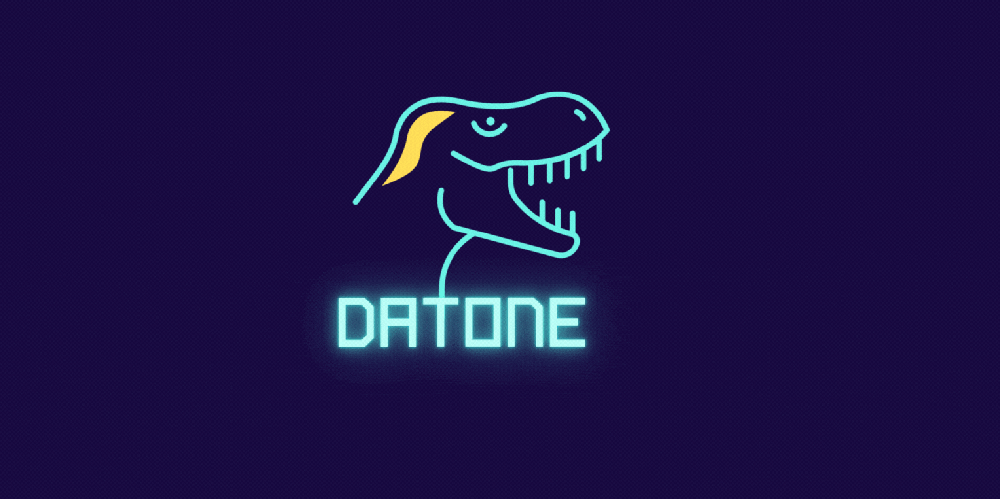
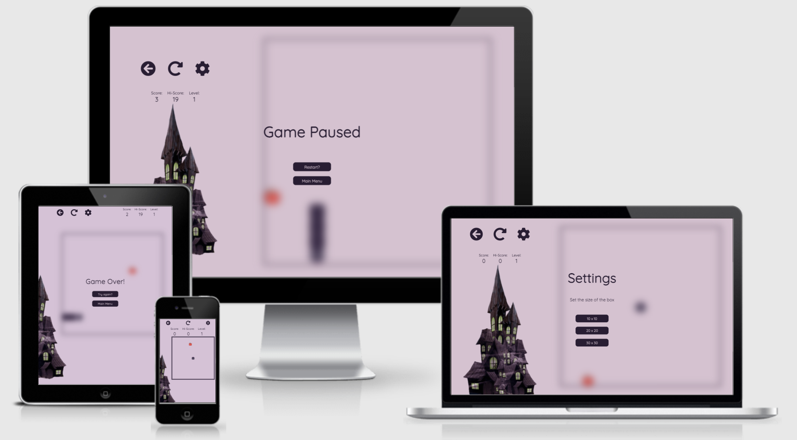
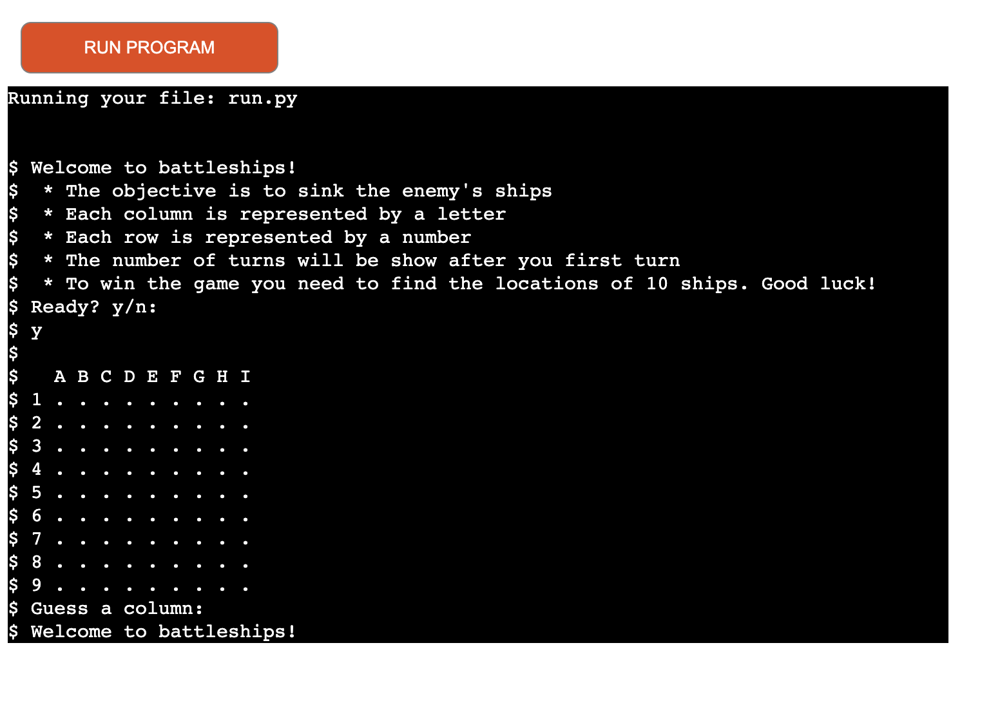
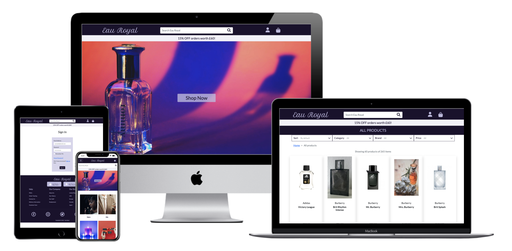

#



## <div style="text-align: center;"> :wave: Hello ! I'm Tanya, aka DatoneX </div>

### <div style="text-align: center;">Full Stack Java developer from London and Code Institute alumni </div>

<div style="text-align: center;"> <a href="https://www.linkedin.com/in/tanyagomwe10/" ></a> <a href="https://www.discord/users/datonex#9338/" ></a> </div>

## <div style="text-align: center;"> Tech Stack </div>

### <div style="text-align: center;"> Languages </div>

<div style="text-align: center;">     </div>

### <div style="text-align: center;"> Libraries + Tools </div>

<div style="text-align: center;">

                     

</div>

## <div style="text-align: center;"> Portfolio Projects </div>

### Visit Zimbabwe

<a href="https://github.com/datonex/visit-zimbabwe" style="background-color: white;" > <a href="https://datonex.github.io/visit-zimbabwe/" style="background-color: white;">

<a href="https://datonex.github.io/visit-zimbabwe/"></a>

Tourist guide website for users who would like to visit Zimbabwe and get information about some of the local sites and activities.

#### Technologies used

   

### The Snake & The Wizard

<a href="https://github.com/datonex/snake-and-the-wizard" style="background-color: white;"> <a href="https://datonex.github.io/snake-and-the-wizard/" style="background-color: white;">

<a href="https://datonex.github.io/snake-and-the-wizard/"></a>

Web based game of the nokia game 'snake' (this was my favourite project)

#### Technologies used

     

### Battleshipasaurus

<a href="https://github.com/datonex/battleship" style="background-color: white;"> <a href="https://battleshipasaurus.herokuapp.com/" style="background-color: white;">

<a href="https://battleshipasaurus.herokuapp.com/"></a>

Famous battleship game played in the terminal

#### Technologies used

  

### OwlNook

<a href="https://github.com/datonex/owl-nook-dx" style="background-color: white;"> <a href="https://owl-nook-dx.herokuapp.com/" style="background-color: white;">

<a href="https://owl-nook-dx.herokuapp.com/"></a>

Web blog where people can post articles to the web.

#### Technologies used

            

### Eau Royal

<a href="https://github.com/datonex/eau-royal" style="background-color: white;"> <a href="https://eau-royal.herokuapp.com/" style="background-color: white;">

<a href="https://eau-royal.herokuapp.com/"></a>

E-commerce perfume and candles web store

#### Technologies used

                

<div style="text-align: center;">

### Stats


<!--START_SECTION:waka-->


📊 **This Week I Spent My Time On** 

```text
💬 Programming Languages: 
No Activity Tracked This Week

```

**I Mostly Code in HTML** 

```text
HTML                     18 repos            ███████████░░░░░░░░░░░░░░   46.15% 
Java                     10 repos            ██████░░░░░░░░░░░░░░░░░░░   25.64% 
JavaScript               5 repos             ███░░░░░░░░░░░░░░░░░░░░░░   12.82% 
Python                   3 repos             ██░░░░░░░░░░░░░░░░░░░░░░░   7.69% 
CSS                      2 repos             █░░░░░░░░░░░░░░░░░░░░░░░░   5.13%

```


 Last Updated on 03/01/2023 18:40:35 UTC
<!--END_SECTION:waka-->

[](https://git.io/streak-stats)


</div>
